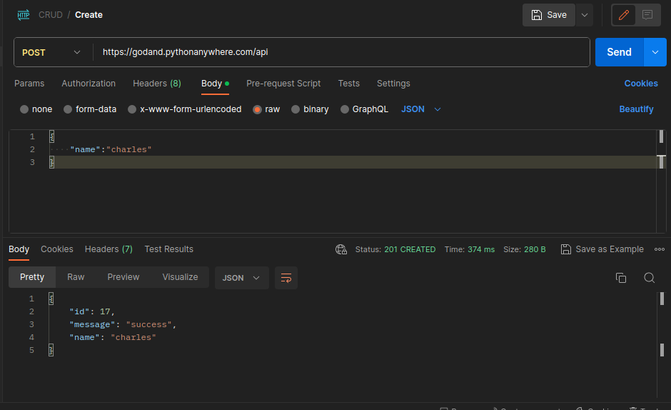
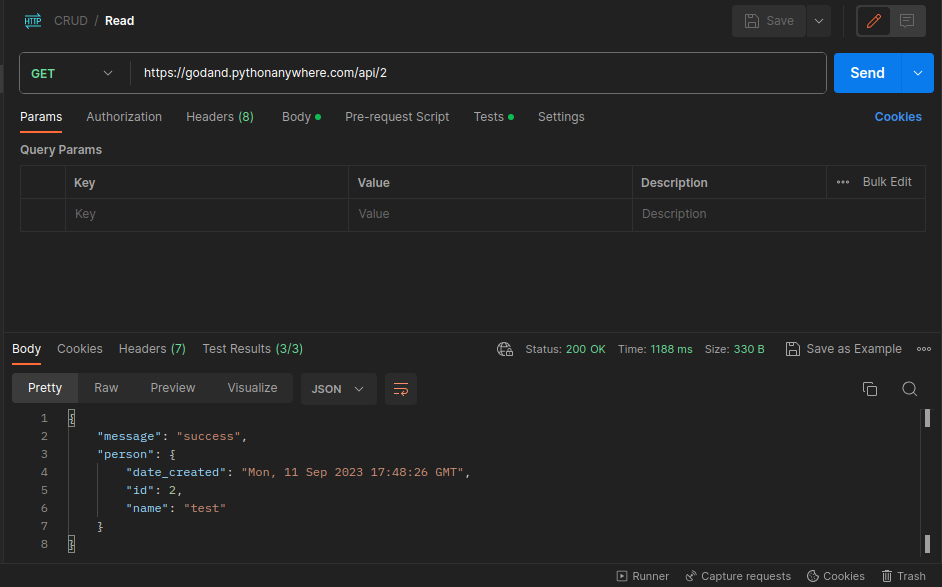
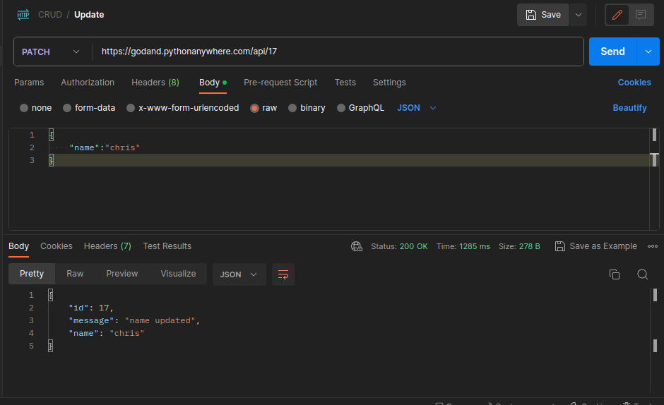
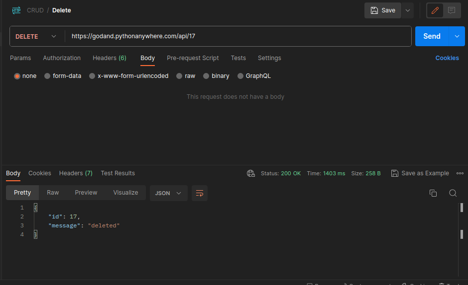

# CRUD_SERVER

## Table Of Contents
- [Set up server for Local Machine](#set-up-the-server-local)
- [DataBase Info](#database-info)
- [Base Uri/Live Deployment](#base-uri)
- [Run API Tests](#run-api-tests)
- [UML Class Diagram](#uml-class-diagram)
- [Error Handling](#error-handling)
- [EndPoints](#endpoints)
  - [Create](#create)
  - [Read](#read)
  - [Update](#update)
  - [Delete](#delete)
- [Sample Usage](#sample-usage)
- [Limitations or Assumptions](#assumptionslimitations)
- [Authors](#authors)

## **CRUD SERVER API-ENDPOINT DOCUMENTATION**
---
<br>
<br>

### **Base Uri**
----
----
Hosted for live testing on **https://godand.pythonanywhere.com**
....
<br>

### **Set up the server (local)**
### Clone The Repository
```bash
$ git clone https://github.com/Godhanded/crudhng.git

$ cd crudhng
```

### Install Dependencies
```bash
# create Virtual Environment
$ python3 -m venv venv

# Activate Virtual Env
$ source venv/bin/activate

# Install Dependencies
$ pip install -r requirements.txt
```

### Run the Server
```bash
$ python3 run.py 
```

### Run API TESTs
***Note:** ensure you are connected to the internet before running tests and are in crudhng directory*
```bash
# install test suite and http requests library
$ pip install requests pytest

# Run the tests in test_crud.py
$ pytest test_crud.py -v
```
[click for test_crud.py file](test_crud.py)

### DataBase Info
- Sqlite file database is used
- SqlAlchemy ORM was used for db interactions
- Sqlite file.db file is created in `/instance` directory when the server is run for the first time.
- DataBase Models [click here](crud/models.py)

<br>


### **Error Handling**
---
---
>Errors are returned as JSON objects in the following format with their error code

```json
{
  "error": "error name",
  "message": "error description"
}
```
The API will return 2 error types, with diffreent descriptions when requests fail;

- 404: resource not found
- 500: Internal server error

<br>

### **EndPoints**
---
---
<br>

#### **Create**

  `POST '/api'`
- Creates a new user and adds them to DataBase
- Request Body: JSON object containing
```json
{
  "name":"name of person",
}
```
- Returns: JSON, Id and Name of created user

```json
 {
    "message": "Success",
    "id": 1,
    "name": "name of person"
 }
```
*status code: 201*

---

<br>


#### **Read**

  `GET '/api/${id}'`
- Gets a person from the database using user id
- Path Parameter: `id`- integer id of person to retrieve 
- Returns: JSON, message and person object containing name id and date created

```json
 {
    "message": "Success",
    "person": {
        "id":1,
        "name":"name of user",
        "date_created":"Mon, 11 Sep 2023 01:04:27 GMT"
    }
 }
```
*status code: 200*

---

<br>

#### **Update**

  `PATCH '/api/${id}'`
- Update or change name of person record
- Path Parameter: `id`- integer id of person to update
- Request Body: Json object containing
```json
 {
    "name":"new name"
 }
```
- Returns: JSON, message and person object containing name id and date created

```json
 {
    "message": "name updated",
    "id": 0,
    "name":"new name"
 }
```
*status code: 200*

---

<br>

#### **Delete**

  `DELETE '/api/${id}'`
- Delete record of Person from database
- Path Parameter: `id`- integer id of person to delete

- Returns: JSON, message and id of deleted record
```json
 {
    "message": "deleted",
    "id": 3
 }
```
*status code: 200*

---

<br>

### **UML CLASS DIAGRAM**
---
<a href="https://github.com/Godhanded/crudhng/blob/main/UML%20Class%20Diagram.png"></a>


## **Assumptions/Limitations**
- Multiple records or persons can have the same name, an ID will make them unique
- Crud operations will be made using a unique identifier id which is provided upon create operation

## **Sample Usage**
<hr>

### Create Operation
<a href="https://github.com/Godhanded/crudhng/blob/main/Images/Create.png"></a>

### Read Operation
<a href="https://github.com/Godhanded/crudhng/blob/main/Images/Read.png"></a>

### Update Operation
<a href="https://github.com/Godhanded/crudhng/blob/main/Images/Update.png"></a>

### Delete Operation
<a href="https://github.com/Godhanded/crudhng/blob/main/Images/Delete.png"></a>

## Authors
- [@Godhanded](https://github.com/Godhanded)